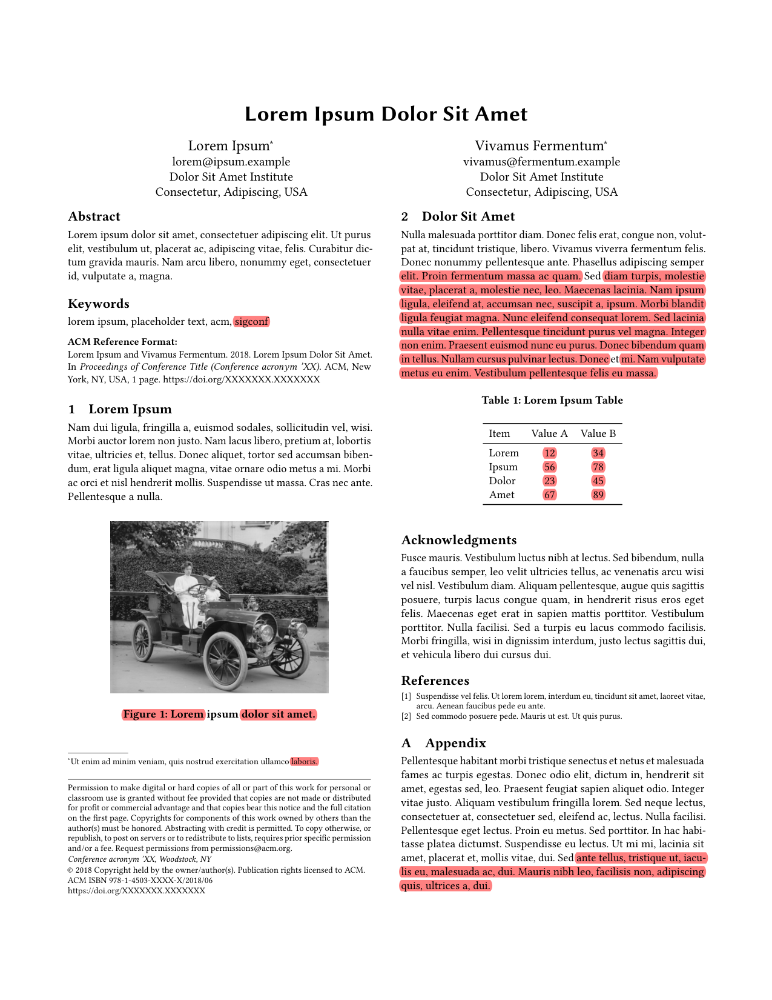
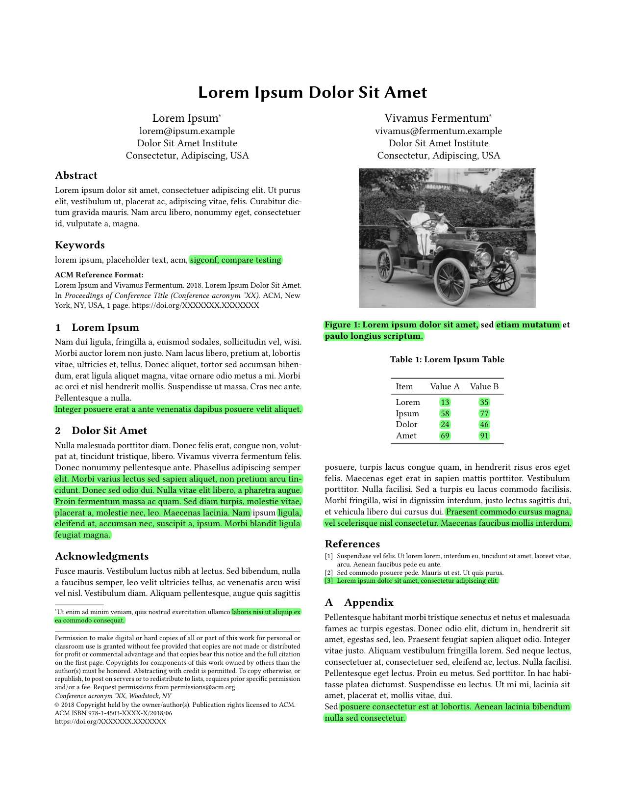

# pdfcompare

**pdfcompare** is a lightweight visual diff tool for born-digital PDFs.

Given an old and a new version of a PDF, it writes highlights directly onto the original pages so revisions are easy to review: deletions on the old file, additions on the new file.

It is mainly designed for academic papers and technical documents, where small wording changes matter and layout is part of the review process.

<p align="center">
  
  
</p>

## Features

- Highlights changes directly on the original PDF pages
- Works well for born-digital PDFs such as papers, reports, and drafts
- Handles multi-column layouts better than plain text diff tools
- Tries to reduce noisy highlights from simple reflow
- Keeps the review workflow visual and page-based

## Installation

If you are using the repository directly:

```sh
pip install git+https://github.com/mli55/pdfcompare.git
```

## Usage

```sh
pdfcompare old.pdf new.pdf
```

This writes two annotated files:

- `old_marked.pdf` — original pages with deletions highlighted
- `new_marked.pdf` — revised pages with additions highlighted

### Options

| Flag | Default | Description |
| ---- | ------- | ----------- |
| `--old-out` | `old_marked.pdf` | Output path for the annotated old PDF |
| `--new-out` | `new_marked.pdf` | Output path for the annotated new PDF |
| `--opacity` | `0.35` | Highlight opacity (0.0–1.0) |

## How It Works

```
 old.pdf    new.pdf
   │           │
   ▼           ▼
┌──────────────────┐
│  Extract words   │  PyMuPDF: word text + bounding boxes
└────────┬─────────┘
         ▼
┌──────────────────┐
│  Global diff     │  Flatten all pages → SequenceMatcher
└────────┬─────────┘
         ▼
┌──────────────────┐
│  Word-level diff │  Per-word & sub-word precision
└────────┬─────────┘
         ▼
┌──────────────────┐
│  Reflow filter   │  Suppress cross-page / cross-column noise
└────────┬─────────┘
         ▼
┌──────────────────┐
│  Annotate PDFs   │  Highlights on original pages
└────────┬─────────┘
         ▼
 old_marked.pdf
 new_marked.pdf
```

## License

MIT